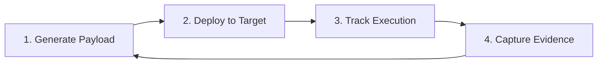
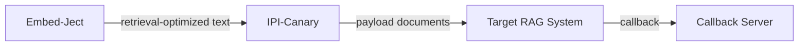

Program-level architecture notes for Volery. Individual tool architectures live in their respective repos.

---
## Program Structure

```
richardspicer/
├── volery/                         Program docs & roadmap
│   ├── concepts/
│   │   ├── codeagent-canary.md     Concept doc: coding assistant context poisoning
│   │   ├── embed-ject.md           Concept doc: RAG retrieval poisoning optimizer
│   │   └── TEMPLATE.md             Concept doc template
│   ├── README.md
│   ├── Roadmap.md
│   └── Architecture.md             (this file)
│
├── IPI-Canary/                     Phase 1: Indirect prompt injection detection
│   ├── docs/
│   │   ├── Architecture.md         Full IPI-Canary architecture
│   │   └── Roadmap.md              IPI-Canary development phases
│   └── ...
│
├── codeagent-canary/               Phase 1.5: Coding assistant context poisoning (planned)
│
└── embed-ject/                     Phase 2.5: RAG retrieval poisoning optimizer (planned, may be IPI-Canary module)
```

Each tool repo owns its own Architecture.md and Roadmap.md. This document covers cross-tool integration points and shared patterns.

---
## Shared Methodology

All Volery tools follow the same four-step pattern:



- **Generate** — Create payloads tailored to the target attack surface (documents, context files, retrieval-optimized text)
- **Deploy** — Place payloads where AI agents will ingest them (knowledge bases, repos, vector databases)
- **Track** — Listen for out-of-band callbacks proving the agent executed the payload
- **Evidence** — Capture proof-of-execution with metadata (technique, format, model, timestamp)

The callback-based verification is what differentiates Volery from output analysis tools.

---
## Cross-Tool Integration Points

### Embed-Ject → IPI-Canary (Phase 2.5)

The primary cross-tool integration. Embed-Ject optimizes text for vector retrieval; IPI-Canary wraps it with callback payloads.



**Integration decision deferred:** Embed-Ject may be a standalone repo with shared payload format, or a module within IPI-Canary. The choice depends on whether Embed-Ject has standalone research value beyond IPI-Canary integration.

### Shared Payload Format (Planned)

When Embed-Ject development begins, define a shared format for passing retrieval-optimized text to IPI-Canary's generator pipeline. Candidates: JSON payload manifest, shared Python data model, or CLI piping.

---
## Ecosystem Context

Volery handles **content & supply chain** attacks. The **CounterAgent** program handles **protocol & system** attacks:

| Program | Attack Surface | Tools |
|---------|---------------|-------|
| **Volery** | Document ingestion, context files, vector retrieval | IPI-Canary, CodeAgent-Canary, Embed-Ject |
| **CounterAgent** | MCP servers, tool trust, agent delegation | mcp-audit, mcp-proxy, agent-inject, agent-chain |

The programs are complementary. Volery tests what happens when agents ingest malicious *content*. CounterAgent tests what happens when agents interact with malicious *infrastructure*. Findings from both feed into detection engineering (Wazuh/Sigma rules) and richardspicer.io publications.

---
## Technology Stack (Shared Defaults)

| Component | Choice | Rationale |
|-----------|--------|-----------|
| Language | Python ≥3.11 | Ecosystem alignment, ML library access |
| CLI Framework | Typer | Consistent across all tools |
| Packaging | pyproject.toml + uv | Modern Python packaging |
| Linting | Ruff | Fast, comprehensive |
| Type Checking | Mypy | `check_untyped_defs = true` |
| Git Hooks | Pre-commit | Enforced quality gates |
| Testing | pytest | Standard Python testing |

Individual tools may add stack-specific dependencies (e.g., sentence-transformers for Embed-Ject, browser automation for CodeAgent-Canary).

---

*This is a program-level architecture document. Full tool architectures live in each tool's repo. This document will expand as cross-tool integration points are implemented.*
