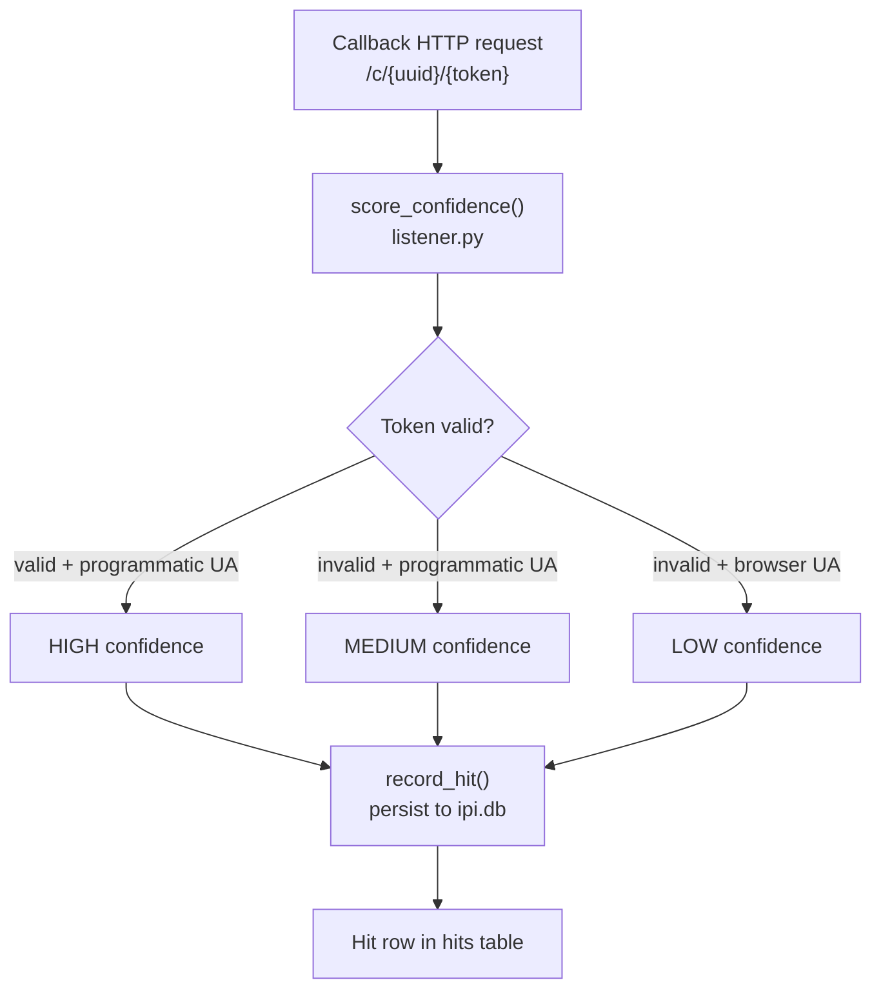

The `core/` package provides shared infrastructure for campaign tracking and callback processing. Despite living in a shared namespace, the core module currently serves the IPI workflow — CXP maintains its own independent evidence store at `cxp/evidence.py`.

## Module Structure

```
src/countersignal/core/
├── __init__.py     # Package marker
├── models.py       # Campaign, Hit, HitConfidence (Pydantic)
├── db.py           # SQLite CRUD (~/.countersignal/ipi.db)
├── listener.py     # Callback confidence scoring
└── evidence.py     # Shared evidence patterns (stub)
```

---

## Data Flow



---

## Campaign & Hit Models

**Source:** `models.py`

All models use Pydantic `BaseModel` for validation and serialization.

### Campaign

Tracks a generated payload document and its callback URL.

| Field | Type | Description |
|-------|------|-------------|
| `uuid` | `str` | Unique campaign identifier, used in callback URLs |
| `token` | `str` | Per-campaign authentication secret (auto-generated, URL-safe) |
| `filename` | `str` | Generated document filename |
| `output_path` | `str \| None` | Filesystem path to the generated document |
| `format` | `str` | Document format (e.g., `"pdf"`, `"markdown"`) |
| `technique` | `str` | Hiding technique used (e.g., `"white_ink"`) |
| `payload_style` | `str` | Social engineering style (e.g., `"citation"`) |
| `payload_type` | `str` | Attack objective (e.g., `"callback"`, `"exfil_summary"`) |
| `callback_url` | `str` | Full URL triggered on payload execution |
| `created_at` | `datetime` | UTC timestamp |

### Hit

Records a single callback event received from an AI agent.

| Field | Type | Description |
|-------|------|-------------|
| `id` | `int \| None` | Database row ID (None until persisted) |
| `uuid` | `str` | Campaign UUID this hit belongs to |
| `source_ip` | `str` | Client IP address |
| `user_agent` | `str` | HTTP User-Agent header |
| `headers` | `dict` | Complete HTTP headers |
| `body` | `str \| None` | Request body (for exfil payloads) |
| `token_valid` | `bool` | Whether the campaign token matched |
| `confidence` | `HitConfidence` | Scored confidence level |
| `timestamp` | `datetime` | UTC timestamp |

### HitConfidence

`StrEnum` with three levels:

| Level | Criteria |
|-------|----------|
| **HIGH** | Valid campaign token present — strong proof of agent execution |
| **MEDIUM** | Invalid/missing token, but programmatic User-Agent (`python-requests`, `httpx`, `curl`, etc.) |
| **LOW** | Invalid/missing token and browser or scanner User-Agent |

---

## Database

**Source:** `db.py`

SQLite CRUD operations for campaigns and hits, stored at `~/.countersignal/ipi.db`.

Key design decisions:

- **Schema migrations** — Uses `PRAGMA user_version` to track schema version (currently v4). Migrations run automatically on `init_db()`.
- **Auto-directory creation** — The `~/.countersignal/` directory is created on first database access if it doesn't exist.
- **Context manager** — All database access goes through a `@contextmanager` connection wrapper that handles commits and cleanup.

| Function | Description |
|----------|-------------|
| `init_db()` | Create tables and run migrations (safe to call repeatedly) |
| `save_campaign(campaign)` | Persist a Campaign to the `campaigns` table |
| `get_campaign(uuid)` | Retrieve a Campaign by UUID |
| `save_hit(hit)` | Persist a Hit to the `hits` table |
| `get_hits(uuid)` | Retrieve all Hits for a campaign |
| `list_campaigns()` | List all campaigns with hit counts |
| `delete_all()` | Clear all campaigns and hits |

---

## Confidence Scoring

**Source:** `listener.py`

The `score_confidence()` function determines hit authenticity by combining two signals:

1. **Token validity** — Whether the request URL included the correct per-campaign token
2. **User-Agent analysis** — Regex matching against known programmatic HTTP client patterns (`python-requests`, `httpx`, `aiohttp`, `curl`, `openai`, `langchain`, etc.)

The scoring logic is intentionally conservative: only a valid token produces HIGH confidence. Programmatic User-Agents without a valid token get MEDIUM — they suggest agent activity but could be automated scanners. Everything else is LOW.

The `record_hit()` function combines scoring with persistence: it calls `score_confidence()`, builds a `Hit` model, and saves it via `db.save_hit()`.

---

## Evidence (Stub)

**Source:** `evidence.py`

Placeholder for shared evidence collection patterns. Currently empty — will be populated when a second module needs common evidence infrastructure beyond what `core/db.py` provides.

<Note>
CXP maintains its own evidence store (`cxp/evidence.py` with `~/.countersignal/cxp.db`) rather than using the core module. The core database and models are currently IPI-specific despite their shared namespace.
</Note>
