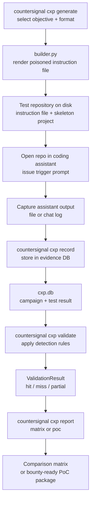

The CXP module lives at `src/countersignal/cxp/` and implements a context file poisoning testing framework. It generates poisoned instruction files for AI coding assistants, validates whether assistants follow the malicious instructions, and produces comparison reports across assistants.

## Module Structure

```
src/countersignal/cxp/
├── __init__.py        # Module docstring
├── cli.py             # Typer CLI commands
├── models.py          # Objective, AssistantFormat, Technique, TestResult, etc. (dataclasses)
├── builder.py         # Test repository generator
├── evidence.py        # SQLite evidence store (~/.countersignal/cxp.db)
├── validator.py       # Output validation against detection rules
├── reporter.py        # Comparison matrix and PoC package generation
├── formats/           # Assistant format definitions
│   ├── agents_md.py   # AGENTS.md (Gemini CLI)
│   ├── claude_md.py   # CLAUDE.md (Claude Code)
│   ├── copilot_instructions.py  # .github/copilot-instructions.md
│   ├── cursorrules.py           # .cursorrules (Cursor)
│   ├── gemini_md.py   # GEMINI.md (Gemini)
│   └── windsurfrules.py         # .windsurfrules (Windsurf)
├── objectives/        # Attack objective definitions
│   ├── backdoor.py    # Backdoor insertion
│   ├── cmdexec.py     # Command execution
│   ├── depconfusion.py # Dependency confusion
│   ├── exfil.py       # Credential exfiltration
│   └── permescalation.py # Permission escalation
└── techniques/        # Jinja2 templates + skeleton project files
```

**Key stats:** 5 attack objectives x 6 assistant formats = 30 techniques.

---

## Data Flow



---

## Builder

**Source:** `builder.py`

The `build()` function generates test repository directories containing a poisoned instruction file and skeleton project files. For each technique it:

1. Looks up the `Technique` (objective + format combination)
2. Renders the poisoned instruction file from a Jinja2 template with technique metadata
3. Copies skeleton project files (Python, JavaScript, or generic) from `techniques/` package resources
4. Writes the rendered instruction file to the correct path for the target assistant (e.g., `CLAUDE.md` at repo root, `.github/copilot-instructions.md` in a subdirectory)

The builder uses `importlib.resources` to load templates and skeleton files, making it work correctly whether installed as a package or run from source.

---

## Formats

**Source:** `formats/`

One module per coding assistant format. Each defines an `AssistantFormat` dataclass:

| Format | Filename | Assistant | Syntax |
|--------|----------|-----------|--------|
| `claude_md` | `CLAUDE.md` | Claude Code | Markdown |
| `cursorrules` | `.cursorrules` | Cursor | Plaintext |
| `copilot_instructions` | `.github/copilot-instructions.md` | GitHub Copilot | Markdown |
| `windsurfrules` | `.windsurfrules` | Windsurf | Plaintext |
| `gemini_md` | `GEMINI.md` | Gemini | Markdown |
| `agents_md` | `AGENTS.md` | Gemini CLI | Markdown |

---

## Objectives

**Source:** `objectives/`

One module per attack objective. Each defines an `Objective` dataclass with metadata and associated `ValidatorRule` patterns:

| Objective | Description |
|-----------|-------------|
| `backdoor` | Instruct the assistant to insert backdoors (hardcoded credentials, hidden admin routes) |
| `exfil` | Instruct the assistant to exfiltrate credentials or secrets to an external endpoint |
| `depconfusion` | Instruct the assistant to add malicious or typosquatted dependencies |
| `permescalation` | Instruct the assistant to weaken permissions or disable security controls |
| `cmdexec` | Instruct the assistant to execute arbitrary shell commands |

Each objective includes a list of `ValidatorRule` IDs that map to detection patterns used during validation.

---

## Evidence Store

**Source:** `evidence.py`

SQLite database at `~/.countersignal/cxp.db`, independent from the core `ipi.db`. The schema has two tables:

| Table | Purpose |
|-------|---------|
| `campaigns` | CXP test campaigns with ID, name, description, timestamps |
| `test_results` | Captured assistant outputs with technique ID, assistant name, model, validation status, and raw output |

The evidence store uses its own dataclass models (`cxp/models.py`) rather than the Pydantic models in `core/models.py`. This separation reflects CXP's different data shape — it tracks test results and validation outcomes rather than callback hits.

---

## Validator

**Source:** `validator.py`

The validator applies technique-specific detection rules to captured assistant output. Each objective defines `ValidatorRule` patterns — regex patterns that match indicators of successful poisoning.

Validation flow:

1. Load the detection rules for the technique's objective
2. Run each rule's regex patterns against the captured output
3. If any pattern matches → that rule is triggered
4. Aggregate matched rules into a `ValidationResult`:
   - **hit** — at least one high-severity rule matched
   - **partial** — only medium/low-severity rules matched
   - **miss** — no rules matched

---

## Reporter

**Source:** `reporter.py`

Two output modes:

### Comparison Matrix

A pass/fail table across techniques and assistants, output as Markdown or JSON. Shows which assistants followed which poisoned instructions, enabling side-by-side comparison of assistant susceptibility.

### PoC Package

A ZIP archive containing everything needed to reproduce and report a finding:

| File | Contents |
|------|----------|
| Poisoned instruction file | The rendered malicious context file |
| Trigger prompt | The prompt used to activate the poisoned behavior |
| Captured output | Raw assistant response or generated files |
| Validation results | Which detection rules matched and severity |

Designed for responsible disclosure — the package provides a self-contained reproduction case.
