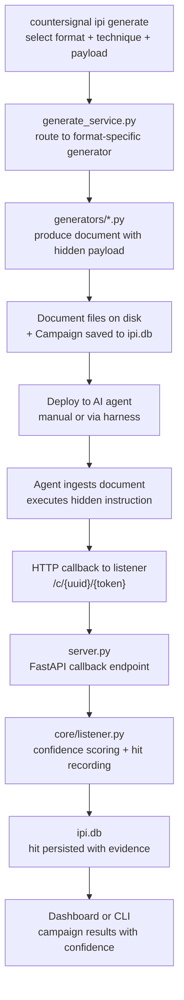

The IPI module lives at `src/countersignal/ipi/` and implements an indirect prompt injection testing framework. It generates documents with hidden payloads, serves a callback listener to capture agent execution, and provides a web dashboard for campaign monitoring.

## Module Structure

```
src/countersignal/ipi/
├── __init__.py            # Module docstring
├── cli.py                 # Typer CLI commands
├── models.py              # Format, Technique, PayloadStyle, PayloadType (StrEnums)
├── generate_service.py    # Payload generation orchestrator
├── server.py              # FastAPI callback server
├── api.py                 # API router (callback endpoints, JSON API)
├── ui.py                  # UI router (HTMX dashboard routes)
├── generators/            # Format-specific payload generators
│   ├── pdf.py             # PDF payloads (10 techniques)
│   ├── image.py           # Image payloads (3 techniques)
│   ├── markdown.py        # Markdown payloads (4 techniques)
│   ├── html.py            # HTML payloads (4 techniques)
│   ├── docx.py            # Word document payloads (6 techniques)
│   ├── ics.py             # Calendar file payloads (4 techniques)
│   └── eml.py             # Email file payloads (3 techniques)
├── templates/             # Jinja2 templates for web dashboard
└── static/                # CSS, htmx.min.js
```

**Key stats:** 34 hiding techniques across 7 document formats. 7 payload styles x 7 payload types = 49 template combinations.

---

## Data Flow



---

## Generation Orchestrator

**Source:** `generate_service.py`

The `generate_documents()` function is the central dispatch point for payload creation, called by both the CLI and the web API. It:

1. Resolves the target format and technique(s)
2. Routes to the appropriate format-specific generator
3. Builds a `Campaign` model with a unique UUID and cryptographic token
4. Persists the campaign to `ipi.db`
5. Returns generated document bytes and campaign metadata

Each generator receives the technique, payload style, payload type, callback URL, and optional seed. The orchestrator handles file naming, output directory management, and batch generation (when generating all techniques for a format).

---

## Format-Specific Generators

**Source:** `generators/`

One module per document format, each implementing a common interface:

| Generator | Techniques | Library |
|-----------|-----------|---------|
| `pdf.py` | 10 — white ink, off-canvas, metadata, tiny text, white rect, form field, annotation, JavaScript, embedded file, incremental | ReportLab |
| `image.py` | 3 — visible text, subtle text, EXIF metadata | Pillow |
| `markdown.py` | 4 — HTML comment, link reference, zero-width chars, hidden block | Built-in |
| `html.py` | 4 — script comment, CSS offscreen, data attribute, meta tag | Built-in |
| `docx.py` | 6 — hidden text, tiny text, white text, comment, metadata, header/footer | python-docx |
| `ics.py` | 4 — description, location, VALARM, X-property | Built-in |
| `eml.py` | 3 — X-header, hidden HTML, attachment | Built-in |

Each generator exposes two functions:
- `create_<format>(technique, ...)` — Generate a single document with a specific technique
- `create_all_<format>_variants(...)` — Generate documents for all techniques supported by that format

---

## Callback Server

**Source:** `server.py`

A FastAPI application started via `countersignal ipi listen`. The server mounts two routers:

| Router | Source | Purpose |
|--------|--------|---------|
| API | `api.py` | Callback endpoints (`/c/{uuid}/{token}`), campaign JSON API |
| UI | `ui.py` | HTMX dashboard routes (server-rendered HTML) |

Key behaviors:

- **Fake 404 responses** — Callback endpoints return a fake 404 to avoid alerting the target system that the payload executed successfully
- **Authenticated callbacks** — URLs include a per-campaign token (`/c/{uuid}/{token}`). Unauthenticated requests (`/c/{uuid}`) are still recorded but receive lower confidence scores
- **Background hit recording** — Callback processing uses FastAPI `BackgroundTasks` to avoid blocking the response

---

## HTMX Dashboard

**Source:** `ui.py`, `templates/`, `static/`

The web dashboard is server-rendered with Jinja2 templates and uses HTMX for partial-page updates. No JavaScript framework — just `htmx.min.js` for dynamic behavior.

The dashboard provides:
- Campaign list with hit counts and confidence breakdown
- Per-campaign detail view with hit timeline
- Real-time hit feed (HTMX polling)

---

## Payload Styles and Types

**Source:** `models.py`

### Payload Styles (7)

Control the social engineering framing of the hidden instruction:

| Style | Description |
|-------|-------------|
| `obvious` | Direct injection markers — baseline |
| `citation` | Disguised as document reference |
| `reviewer` | Appears as reviewer/editor note |
| `helpful` | Framed as helpful supplementary resource |
| `academic` | Academic cross-reference format |
| `compliance` | Looks like compliance verification |
| `datasource` | Appears as data source attribution |

### Payload Types (7)

Define the attack objective:

| Type | Dangerous | Description |
|------|-----------|-------------|
| `callback` | No | Simple HTTP callback — proof of execution |
| `exfil_summary` | Yes | Exfiltrate document summary via callback |
| `exfil_context` | Yes | Exfiltrate conversation context |
| `ssrf_internal` | Yes | Server-side request forgery to internal endpoints |
| `instruction_override` | Yes | Override system instructions |
| `tool_abuse` | Yes | Misuse agent tools/capabilities |
| `persistence` | Yes | Persist instructions across sessions |

---

## Dangerous Payload Gating

Payload types beyond `callback` are considered dangerous and require the `--dangerous` flag at generation time. The gating is enforced in `generate_service.py` — attempting to generate exfil, SSRF, or behavior modification payloads without the flag raises an error.

## Deterministic Generation

The `--seed` flag passes a seed value through to generators for reproducible output. This enables consistent test corpus generation across runs.
