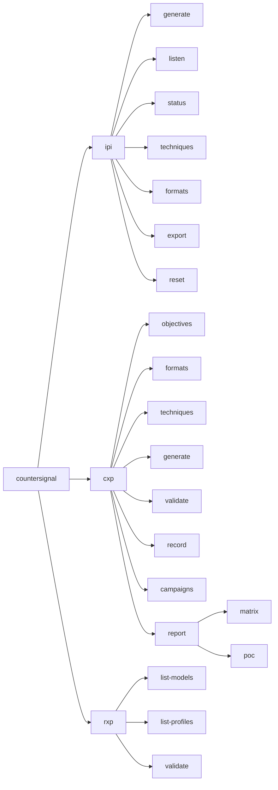

CounterSignal is a single Python package (`countersignal`) with three modules — IPI, CXP, and RXP — mounted under a unified Typer CLI. All modules share a common entry point and are installed together.

## Package Layout

```
src/countersignal/
├── __init__.py       # Package version
├── __main__.py       # python -m countersignal support
├── cli.py            # Root Typer app — mounts ipi, cxp, rxp
├── core/             # Shared callback infrastructure (campaigns, hits, SQLite)
├── ipi/              # Indirect prompt injection testing
├── cxp/              # Context file poisoning testing
└── rxp/              # RAG retrieval poisoning validation
```

## CLI Hierarchy

The root `cli.py` creates a top-level Typer application and mounts three subcommand groups — one per module. Each module defines its own `cli.py` with a Typer sub-app that is added via `app.add_typer()`.



## Technology Stack

| Layer | Technology | Used by |
|-------|-----------|---------|
| CLI framework | [Typer](https://typer.tiangolo.com/) + [Rich](https://rich.readthedocs.io/) | All modules |
| Callback server | [FastAPI](https://fastapi.tiangolo.com/) + [Uvicorn](https://www.uvicorn.org/) | IPI |
| Web dashboard | [HTMX](https://htmx.org/) + [Jinja2](https://jinja.palletsprojects.com/) templates | IPI |
| Template rendering | Jinja2 | CXP (poisoned files), IPI (dashboard) |
| Data storage | SQLite | IPI (`core/db.py`), CXP (`cxp/evidence.py`) |
| Data models | [Pydantic](https://docs.pydantic.dev/) (core), dataclasses (CXP, RXP) | All modules |
| Embedding models | [sentence-transformers](https://sbert.net/) (optional) | RXP |
| Vector search | [ChromaDB](https://www.trychroma.com/) (optional) | RXP |
| Document generation | [ReportLab](https://docs.reportlab.com/) (PDF), [Pillow](https://pillow.readthedocs.io/) (images), [python-docx](https://python-docx.readthedocs.io/) (DOCX) | IPI |

## Database Architecture

CounterSignal uses two separate SQLite databases, both stored in `~/.countersignal/`:

| Database | Managed by | Purpose |
|----------|-----------|---------|
| `ipi.db` | `core/db.py` | Campaign tracking and callback hit recording. Schema versioned via `PRAGMA user_version` (currently v4). |
| `cxp.db` | `cxp/evidence.py` | CXP test campaigns and captured assistant output. Independent schema and models. |

Both databases auto-create their parent directory on first access. See [Shared Core](/documentation/architecture/core) for `ipi.db` schema details.

<Note>
RXP uses ephemeral in-memory ChromaDB collections — no persistent database.
</Note>

## Module Architecture Pages

Each module has its own architecture page with file layout, data flow, and component breakdown:

- [Shared Core](/documentation/architecture/core) — Campaign models, callback infrastructure, SQLite CRUD
- [IPI Module](/documentation/architecture/ipi-module) — Generator framework, callback server, HTMX dashboard
- [CXP Module](/documentation/architecture/cxp-module) — Builder pipeline, evidence store, validator, reporter
- [RXP Module](/documentation/architecture/rxp-module) — Embedding registry, retrieval validation, ChromaDB integration
