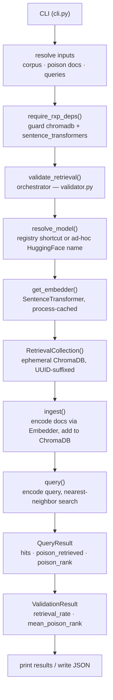

The RXP module lives at `src/countersignal/rxp/` and implements a retrieval poisoning validation engine. It measures whether adversarial documents achieve retrieval rank in vector similarity searches across configurable embedding models.

## Module Structure

```
src/countersignal/rxp/
├── __init__.py         # Module docstring
├── _deps.py            # Optional dependency guard
├── cli.py              # Typer CLI commands
├── collection.py       # RetrievalCollection (ChromaDB wrapper)
├── embedder.py         # Embedder abstraction (sentence-transformers)
├── models.py           # Data models (dataclasses)
├── registry.py         # Embedding model registry and resolution
├── validator.py        # Validation engine orchestration
└── profiles/           # Built-in domain profiles
    ├── __init__.py     # Profile loader
    └── hr_policy/      # HR policy test scenario
```

---

## Data Flow

A `validate` run follows this pipeline:



---

## Embedding Model Registry

**Source:** `registry.py`

The registry maps shortcut IDs (e.g. `minilm-l6`) to `EmbeddingModelConfig` dataclasses containing the full HuggingFace model name, vector dimensions, and description.

Three models are registered by default. The `resolve_model()` function first checks the registry; if the ID is not found, it creates an ad-hoc config using the ID as the HuggingFace model name. This allows arbitrary model names (e.g. `BAAI/bge-m3`) to pass through without registry changes.

---

## Embedder Abstraction

**Source:** `embedder.py`

The `Embedder` class wraps `sentence_transformers.SentenceTransformer` with two methods:

- **`encode(texts)`** — Batch-encode a list of strings into float vectors
- **`similarity(query, candidates)`** — Cosine similarity via NumPy (available but not used in the current pipeline — ChromaDB handles nearest-neighbor search internally)

Embedder instances are cached by model name in a module-level dictionary (`get_embedder()`). The cache avoids reloading models when running `--model all`.

---

## RetrievalCollection

**Source:** `collection.py`

`RetrievalCollection` wraps a ChromaDB ephemeral client. Key design decisions:

- **Ephemeral storage** — Uses `chromadb.Client()` (in-memory). No data persists between runs. Each validation is a clean-room test.
- **Pre-computed embeddings** — Documents are encoded by the injected `Embedder`, not by ChromaDB's built-in embedding functions. This gives full control over which model produces the vectors.
- **UUID-suffixed collection names** — Prevents collisions when multiple collections exist in the same process.
- **Poison tracking** — `is_poison` and `source` metadata are stored as ChromaDB document metadata. Poison document IDs are tracked in a set for O(1) lookup during query result mapping.

Methods:

| Method | Description |
|--------|-------------|
| `ingest(documents)` | Encode and store a list of `CorpusDocument` objects |
| `query(query_text, top_k)` | Embed the query, run nearest-neighbor search, return `RetrievalHit` list |
| `reset()` | Delete and recreate the collection |
| `count` | Number of stored documents |

---

## Validation Engine

**Source:** `validator.py`

The `validate_retrieval()` function orchestrates a single validation run:

1. Resolve the model config from the registry (or create ad-hoc)
2. Get or create a cached `Embedder` instance
3. Create a `RetrievalCollection` and ingest corpus + poison documents
4. Run each query and build `QueryResult` objects (recording whether the poison document was retrieved and at what rank)
5. Aggregate into a `ValidationResult` with retrieval rate and mean poison rank

The CLI handles the multi-model loop — when `--model all` is used, it calls `validate_retrieval()` once per registered model and prints a comparison table.

---

## Domain Profile Loading

**Source:** `profiles/__init__.py`

Profiles are auto-discovered by scanning subdirectories of the `profiles/` package for `profile.yaml` files. No registration is required — drop a new directory with the right structure and it appears in `list-profiles`.

The loader uses `yaml.safe_load` (not `yaml.load`) for safety. Corpus and poison documents are loaded from `corpus/*.txt` and `poison/*.txt` within the profile directory, with the filename stem used as the document ID.

---

## Optional Dependency Guard

**Source:** `_deps.py`

RXP depends on `sentence-transformers` and `chromadb`, which are heavy optional dependencies. The `require_rxp_deps()` function checks for their presence at runtime and raises `ImportError` with install instructions if either is missing.

The guard is called inside the `validate` command body, after argument parsing. This means `--help`, `list-models`, and `list-profiles` all work without the optional dependencies installed. Users only need the heavy packages when actually running validation.

Install with:

```bash
pip install countersignal[rxp]
# or
uv sync --extra rxp
```
